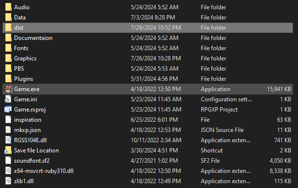
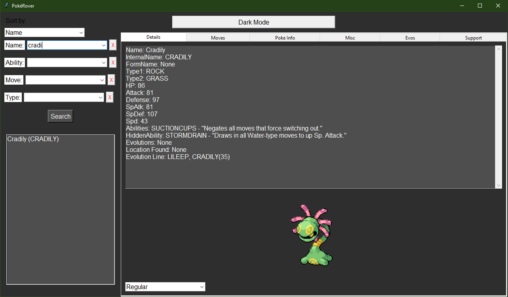
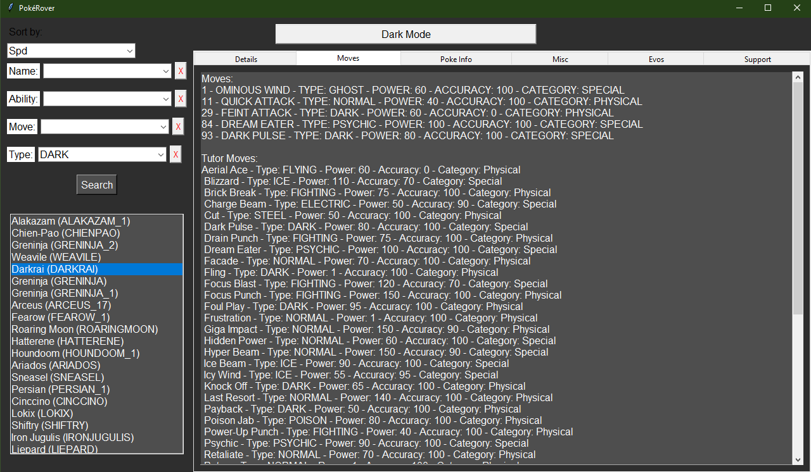
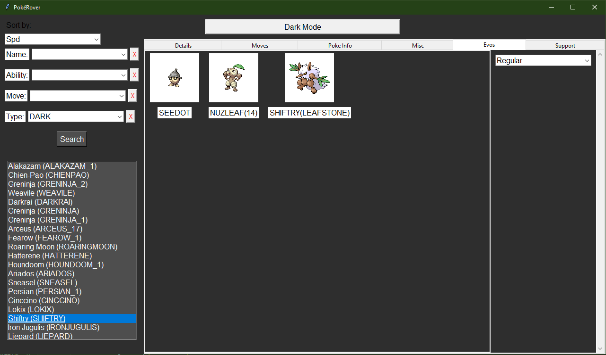

# PokéRover

PokéRover is a Python-based application for browsing Pokémon essentials data. It allows users to search for Pokémon by name, view details about each Pokémon, and explore their moves, abilities, and other information.

## HOW TO: Vanguard Players

- Dowload and extract 'dist.zip', place it here  and your path should look like this. 
- As of right now, it is updated to patch 3.0.16. I will update this version whenever I update the PBS files. If you notice that the version is way off, have someone in the Vanguard server gen them for you. (Probably not required soon if ever)

## HOW TO: Players of other fan games

1. Dowload and extract 'dist.zip', place it here  and your path should look like this. 
2. Replace the PBS files 'abilities.txt' , 'encounters.txt', 'moves.txt', and 'pokemon.txt' with the other games files. All built in PBS files are from Vanguard.
3. If you want megas or forms to work you will need a converted 'pokemon.txt' file as 'pokemon_forms.txt', which usually holds megas is not supported. Contact a dev of the game to reach out to me and we can sort it out.

## HOW TO: Developers
- For now, contact me on Discord @sexyrexy1212 for support, will have to walk your through using @PDM20's converter to make it work properly.

## Examples

## Features

- **Search**: Users can search for Pokémon by name using the search bar.
- **Details**: After selecting a Pokémon from the search results, users can view detailed information about that Pokémon, including its stats, type, abilities, and more.
- **Moveset**: Users can explore the moveset of each Pokémon, including their level-up moves, egg moves, and tutor moves.
- **Poke Info**: Additional information about each Pokémon, such as its height, weight, and base experience yield, is available in the Poke Info tab.
- **Miscellaneous Info**: The Miscellaneous tab provides other interesting facts and trivia about each Pokémon.
- **Dark Mode**: Users can toggle between light and dark mode for improved readability.

## Usage

Once the application is running, follow these steps to use it:

1. Enter the name of the Pokémon you want to search for in the search bar.
2. Select the desired Pokémon from the search results.
3. Explore the various tabs (Details, Moves, Poke Info, Miscellaneous, Evos) to learn more about the selected Pokémon. You can even click an evolution to switch to that page.
4. Funny toggle between light and dark mode.

## Dependencies if using method two for using PokeRover

- Python 3.x
- pandas
- tkinter
- Pillow (PIL)
- pokedexcel

## Code

 - All source code is in those Python scripts you see in main.
 -  __pokemon_lookup.py__ has relatively few comments and will always be stable
 -  __pokemon_lookup_test.py__ has all my comments and could possibly be non-functional

## Contributing

Contributions are welcome! If you find any bugs or have suggestions for improvements, please feel free to message me on Discord, do your own pull requests, or raise an issue!

## For devs
- The only thing that should need to be changed is the format of PBS files unless it's a real old version I don't know anyting about
